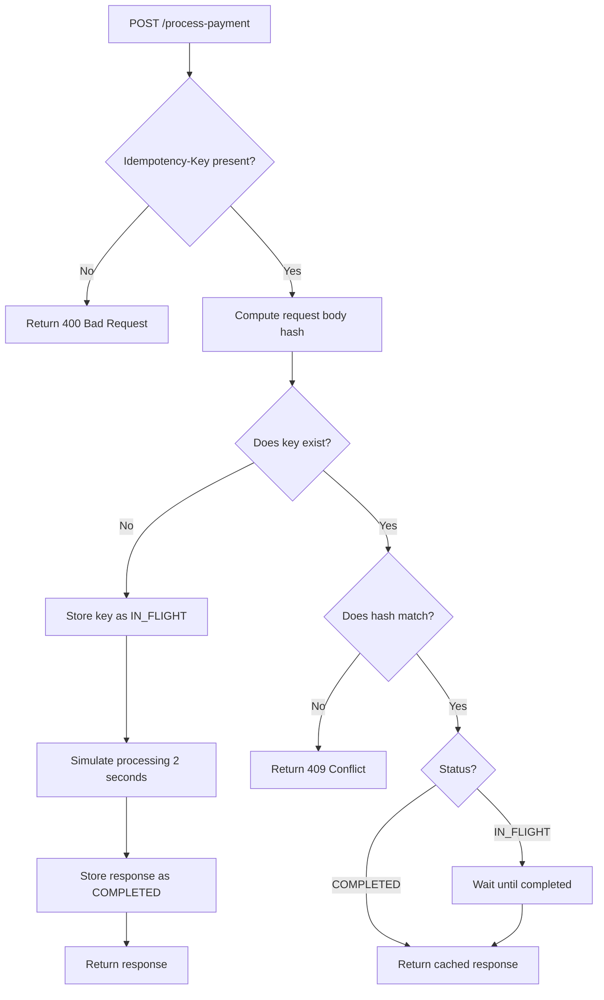

1. ## Architecture Diagram



2. ## Setup Instructions

 Requirements
- Python 3.10+
- Git

 Clone Repository
```powershell
git clone https://github.com/ksefa00/Idempotency-Gateway.git
cd Idempotency-Gateway

## Create Virtual Environment
 python -m venv venv

 ## Activate Virtual Environment (Windows PowerShell)
  .\venv\Scripts\Activate.ps1

## Install Dependencies
pip install -r requirements.txt

## Run the Server
uvicorn main:app --reload

So the server will run at: http://127.0.0.1:8000

API documentation is available at: http://127.0.0.1:8000/docs
```


## 3. API Documentation

GET /

Health check endpoint.

**Response**
```json
{
  "message": "Idempotency Gateway is running"
}

##  POST /process-payment

Processes a payment request.

Header

Idempotency-Key: <unique-string>

Request Body
{
  "amount": 100,
  "currency": "GHS"
}

## First Request Response

- Status: 201 Created

- Header: X-Cache-Hit: false

- Body:
{
  "message": "Charged 100.0 GHS"
}

## Duplicate Request Response

- Status: 201 Created

- Header: X-Cache-Hit: true

- Same response body as first request

Conflict (Same Key, Different Body)

- Status: 409 Conflict

- Body:
{
  "detail": "Idempotency key already used for a different request body."
}
```

## 4. Design Decisions
- Used in-memory dictionary as allowed by the challenge.

- Used stable JSON hashing to detect payload tampering.

- Stored both response body and status code to ensure exact replay.

- Used async locking to prevent race conditions.

- Implemented in-flight waiting so concurrent identical requests do not double-process.

