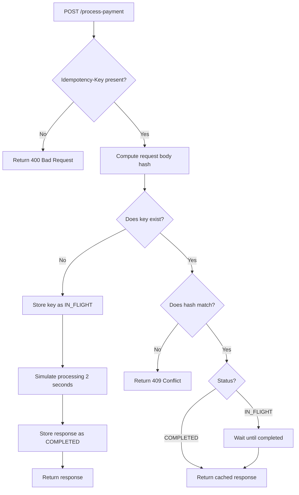

1. ## Architecture Diagram



2. ## Setup Instructions

### Requirements
- Python 3.10+
- Git

### Clone Repository
```powershell
git clone https://github.com/ksefa00/Idempotency-Gateway.git
cd Idempotency-Gateway

## Create Virtual Environment
 python -m venv venv

 ## Activate Virtual Environment (Windows PowerShell)
  .\venv\Scripts\Activate.ps1

## Install Dependencies
pip install -r requirements.txt

## Run the Server
uvicorn main:app --reload

So the server will run at: http://127.0.0.1:8000

API documentation is available at: http://127.0.0.1:8000/docs
```

3. ## API Documentation section
Examples:
POST /process-payment

Header: Idempotency-Key: test123

Body: {"amount":100,"currency":"GHS"}

Response: "Charged 100 GHS"

